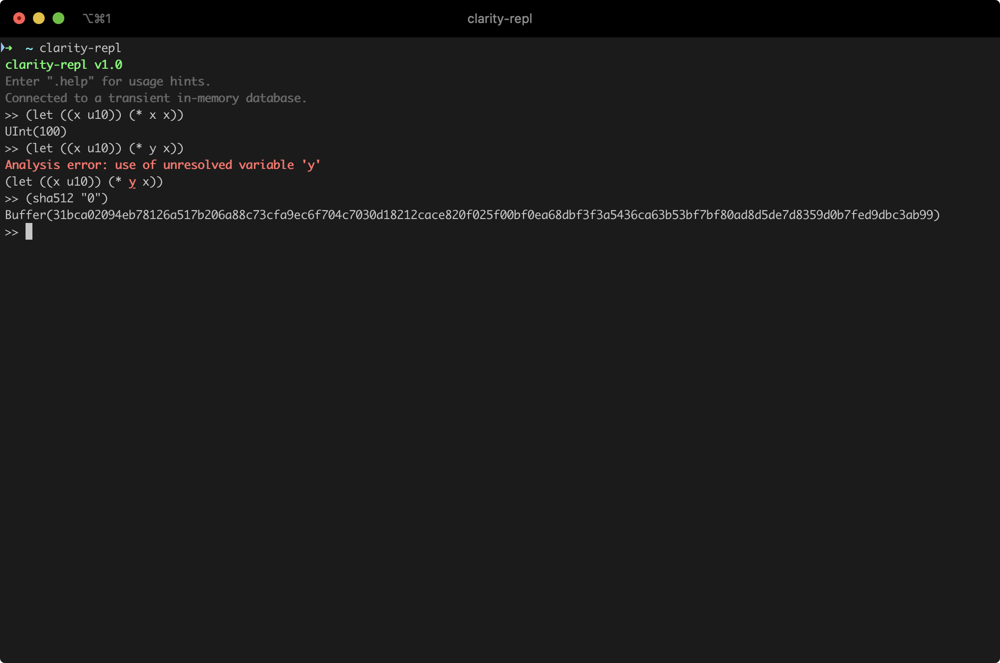

# clarity-repl

Clarity is a **decidable** smart contract language that optimizes for predictability and security, designed by Blockstack. Smart contracts allow developers to encode essential business logic on a blockchain. 

A programming language is decidable if you can know, with certainty, from the code itself what the program will do. Clarity is intentionally Turing incomplete as it avoids `Turing complexity`. This allows for complete static analysis of the entire call graph of a given smart contract. Further, our support for types and type checker can eliminate whole classes of bugs like unintended casts, reentrancy bugs, and reads of uninitialized values.

A read–eval–print loop (REPL), also termed an interactive toplevel or language shell, is a simple, interactive computer programming environment that takes single user inputs (i.e., single expressions), evaluates (executes) them, and returns the result to the user; a program written in a REPL environment is executed piecewise.



## Quick Start

### Building the CLI from source

The first step is to ensure that you have Rust and the support software installed.

```bash
curl --proto '=https' --tlsv1.2 -sSf https://sh.rustup.rs | sh
```

From there, you can clone this repository:

```bash
git clone https://github.com/lgalabru/clarity-repl.git

cd clarity-repl
```

Then build and install:

```bash
cargo install --bin clarity-repl --path .
```

### Building the WASM library

```bash
cargo install wasm-pack
cargo build --lib --release --no-default-features --features wasm --target wasm32-unknown-unknown
```


## Initial feature set
- [x] Eval clarity expressions (arithmetic, logic, hash functions)
- [x] Display formatted errors
- [x] Ability to produce WASM builds
- [x] Full support of persisted data (define-map, define-data-var, define-fungible-token, define-non-fungible-token)

## Additional desired features (not exhaustive, not prioritized)
- [x] Display documentation
- [ ] Display cost analysis
- [ ] Display events
- [ ] Save snippets as contracts that can be `contract-call?` when public functions or traits are detected
- [ ] Ability to seed stx balances
- [ ] Test WASM builds in browser
- [ ] Easier installation (via brew, etc)


