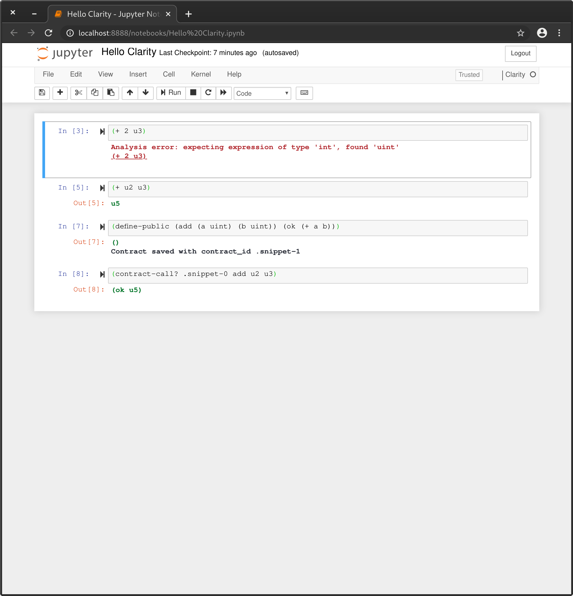

# clarity-jupyter-kernel

Clarity is a **decidable** smart contract language that optimizes for predictability and security, designed by Blockstack. Smart contracts allow developers to encode essential business logic on a blockchain. 

A programming language is decidable if you can know, with certainty, from the code itself what the program will do. Clarity is intentionally Turing incomplete as it avoids `Turing complexity`. This allows for complete static analysis of the entire call graph of a given smart contract. Further, our support for types and type checker can eliminate whole classes of bugs like unintended casts, reentrancy bugs, and reads of uninitialized values.

The Jupyter Notebook is an open-source web application that allows you to create and share documents that contain live code, equations, visualizations and narrative text. Uses include: data cleaning and transformation, numerical simulation, statistical modeling, data visualization, machine learning, and much more.

A notebook kernel is a `computational engine` that executes the code contained in a Notebook document.

When you open a Notebook document, the associated kernel is automatically launched. When the notebook is executed (either cell-by-cell or with menu Cell -> Run All), the kernel performs the computation and produces the results. Depending on the type of computations, the kernel may consume significant CPU and RAM. Note that the RAM is not released until the kernel is shut-down.



## Quick Start

The first step is to install jupyter-notebook, with pip or your favourite packet manager (brew, pacman, etc).
You can then build and install the kernel handling Clarity:

### Building from source

The first step is to ensure that you have Rust and the support software installed.

```bash
curl --proto '=https' --tlsv1.2 -sSf https://sh.rustup.rs | sh
```

From there, you can clone this repository:

```bash
git clone https://github.com/lgalabru/clarity-jupyter-kernel.git

cd clarity-jupyter-kernel
```


```bash
cargo install --path . 
clarity-jupyter-kernel --install
```

By starting jupyter-notebook
```bash
jupyter-notebook
```

You can now create a new Notebook with Clarity.

