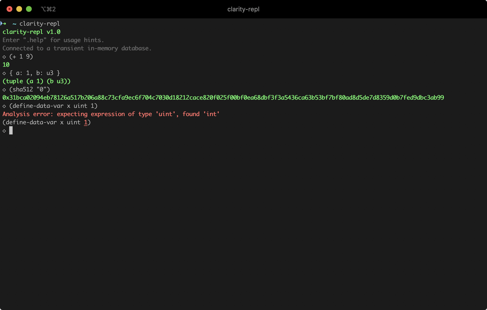

# clarity-repl

Clarity is a **decidable** smart contract language that optimizes for predictability and security, designed by Blockstack. Smart contracts allow developers to encode essential business logic on a blockchain. 

A programming language is decidable if you can know, with certainty, from the code itself what the program will do. Clarity is intentionally Turing incomplete as it avoids `Turing complexity`. This allows for complete static analysis of the entire call graph of a given smart contract. Further, our support for types and type checker can eliminate whole classes of bugs like unintended casts, reentrancy bugs, and reads of uninitialized values.

A read–eval–print loop (REPL), also termed an interactive toplevel or language shell, is a simple, interactive computer programming environment that takes single user inputs (i.e., single expressions), evaluates (executes) them, and returns the result to the user; a program written in a REPL environment is executed piecewise.



## Quick Start

### Building from cargo

```bash
cargo install clarity-repl
```

### Building the CLI from source

The first step is to ensure that you have Rust and the support software installed.

```bash
curl --proto '=https' --tlsv1.2 -sSf https://sh.rustup.rs | sh
```

From there, you can clone this repository:

```bash
git clone https://github.com/hirosystems/clarity-repl.git

cd clarity-repl
```

By default, you will be in our development branch, `develop`, with code that has not been released yet. If you plan to submit any changes to the code, then this is the right branch for you. If you just want the latest stable version, switch to the main branch:

```bash
git checkout main
```

Then build and install:

```bash
cargo install --bin clarity-repl --path .
```

You can then run the REPL with the command:

```bash
clarity-repl
```

### Building the WASM library

```bash
cargo install wasm-pack
wasm-pack build --target web --release -- --no-default-features --features wasm
```

## Initial feature set

- [x] Eval clarity expressions (arithmetic, logic, hash functions)
- [x] Display formatted errors
- [x] Ability to produce WASM builds
- [x] Full support of persisted data (define-map, define-data-var, define-fungible-token, define-non-fungible-token)

## Additional desired features (not exhaustive, not prioritized)

- [x] Display documentation
- [ ] Display cost analysis
- [x] Display events
- [x] Save snippets as contracts that can be `contract-call?` when public functions or traits are detected
- [x] Ability to seed stx balances
- [x] Test WASM builds in browser
- [x] Ability to write Clarity contracts in Jupyter notebooks
- [ ] Easier installation (via brew, etc)
