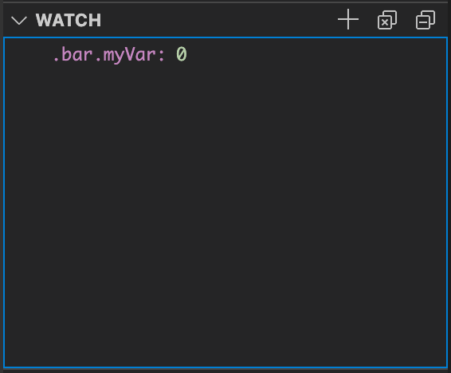
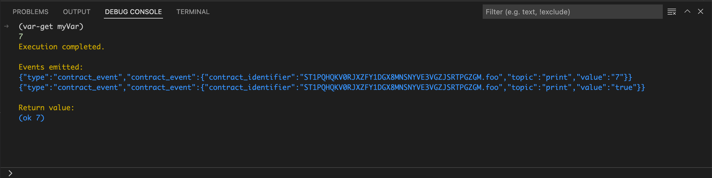
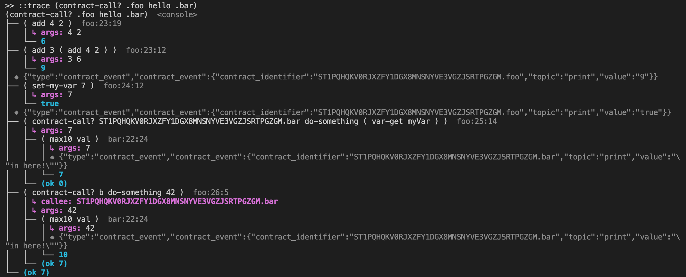

## VS Code Debugger

Clarinet supports the [Debug Adapter Protocol](https://microsoft.github.io/debug-adapter-protocol/) (DAP), which enables you to debug your smart contracts inside of Visual Studio Code (VS Code), or any code editor supporting the DAP protocol.

To set up a debug session, you will first need to create a `launch.json` file to tell VS Code what you want to debug.
The easiest way to accomplish this is to let VS Code generate the template for you by opening the "Run and Debug" view and clicking "create a launch.json file".


This will create the file `.vscode/launch.json` with the default template:

```json
{
  // Use IntelliSense to learn about possible attributes.
  // Hover to view descriptions of existing attributes.
  // For more information, visit: https://go.microsoft.com/fwlink/?linkid=830387
  "version": "0.2.0",
  "configurations": [
    {
      "type": "clarinet",
      "request": "launch",
      "name": "Call .foo.bar",
      "manifest": "${workspaceFolder}/Clarinet.toml",
      "expression": "(contract-call? .foo bar 42)"
    }
  ]
}
```

Depending on your needs, you will want to set the `name` field to whatever makes sense for your project, then set the `expression` to the Clarity expression that you would like to debug. In the case of the default example shown in the template above, the debugger would start executing the `bar` function of the `foo`  contract, passing the argument `42`. Once this file is configured, the debugger works as expected for any [VS Code debugging](https://code.visualstudio.com/docs/editor/debugging).

Execution begins paused at the first expression. The debug toolbar includes buttons to continue, 
step over, step into, step out, restart, and stop, in that order.


Breakpoints can be set by clicking in the left gutter next to the code or using the right-click menu at a specific code location.


Data watchpoints may also be set, by clicking the "+" in the Watch section of the Debug sidebar and typing the contract variable to watch in the format `<principal>.<contract>.<name>`, or using the shortcut for a local contract, `.<contract>.<name>`. When a watchpoint is set on a contract variable, execution will pause when its value will change.



During execution, the values of the current contract's variables, the current function's arguments, and any local variables (i.e. from a `let` expression) are shown in the sidebar. The current watchpoints are also shown with their current values. In both cases, the contents of a map are not shown but can be queried in the Debug Console. The call stack is also updated to show the call stack of the current execution.


At any point during execution, an expression can be evaluated in the current context via the Debug Console. 
Simply type any valid Clarity expression and hit enter to evaluate it. Upon completion, the events emitted and the return value are printed to the debug console.



For more information on how to debug your smart contract using the VS Code Extension, please see the [How To Debug Smart Contracts In Clarinet's VS Code Extension](https://www.youtube.com/watch?v=DsLCDQSijwk) video walkthrough.

## Command-Line Debugger

Inside the console (`clarinet console`), there is a debugger for stepping through your contracts 
on the command line, including support for:

- Breakpoints
  - **Source**: Break at a specific line (and optional column) of a contract (`break` or `b` command)
    ```
    b SP466FNC0P7JWTNM2R9T199QRZN1MYEDTAR0KP27.miamicoin-token:28:4
    ```
  - **Function**: Break at a specific function (`break` or `b` command)
    ```
    b .crashpunks-v2.transfer
    ```
  - **Data**: Break on read/write to a variable or map (`watch` or `w` to break on write, `rwatch` or `rw` 
  - to break on read, and `awatch` or `aw` to break on read or write)
    ```
    w contracts/SP2KAF9RF86PVX3NEE27DFV1CQX0T4WGR41X3S45C.bitcoin-whales.payout
    ```
- Step execution
  - **Step-in**: Step into the sub-expressions (`step` or `s` command)
  - **Step-out**: Complete execution of the current expression and return the result to the parent (`finish` or `f` command)
  - **Step-over**: Continue to completion of the current expression, stepping over sub-expressions (`next` or `n` command)
  - **Continue**: Continue execution until hitting a breakpoint or completing execution (`continue` or `c` command)
- Evaluate and print the result of any expression (`print` or `p` command)

To initiate a debug session, first enter the Read, Evaluate, Print, Loop (REPL) console using the command shown below.

```
clarinet console
```

Then at the REPL prompt, use this command to debug any expression.

```
::debug (contract-call? .foo hello .bar))
```

At the debug prompt, use any of the commands described above, or use `help` to get the full help documentation.

For more information on debugging smart contracts, please see the [Debugging Smart Contracts](https://www.hiro.so/blog/how-to-debug-your-smart-contracts-with-clarinet) blog post.

For a video walkthrough on how to debug your smart contracts, please see the [Debug Your Smart Contracts With Clarinet's New Inline Debugger](https://www.youtube.com/watch?v=nVDWeuMnkDs)video.

## Execution Trace

When you are in the console (`clarinet console`), the `::trace <expr>` command enables you to execute an expression and print a trace of the execution, which can be very helpful in identifying problems with the contract.

This trace shows all function calls, both internal calls to private functions and contract calls to other contracts. 
For each call, the parameters and return value are shown in the trace. Any events that are emitted are also shown in the trace.




